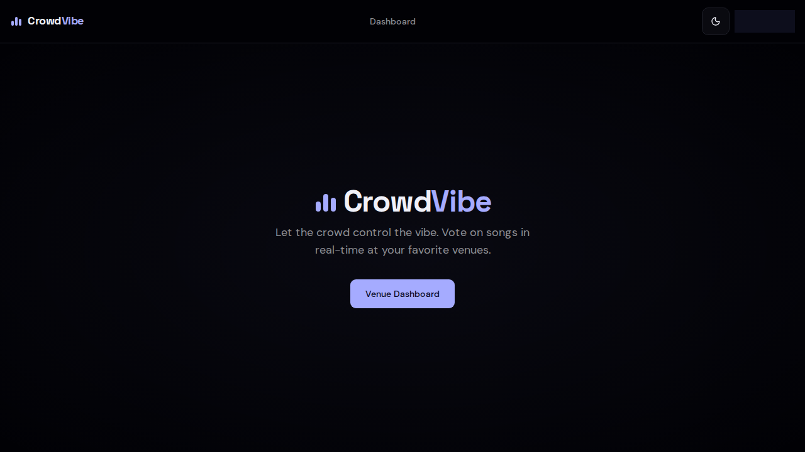
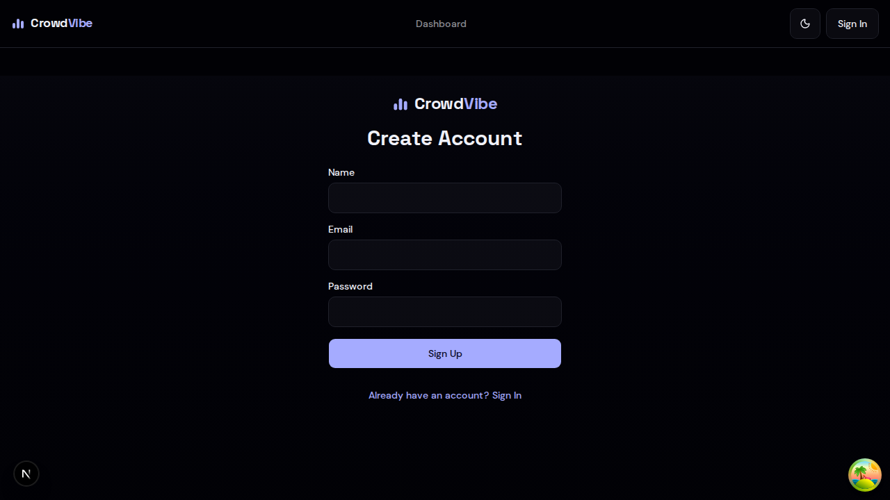

<p align="center">
  <picture>
    <source media="(prefers-color-scheme: dark)" srcset="apps/web/public/logo-full-dark.svg">
    <source media="(prefers-color-scheme: light)" srcset="apps/web/public/logo-full.svg">
    
  </picture>
</p>

<p align="center">
  <strong>Crowd-controlled music for venues</strong><br>
  Let your customers vote on what plays next
</p>

<p align="center">
  <a href="LICENSE"></a>
  
  
  
  
</p>

<p align="center">
  <a href="#what-is-crowdvibe">About</a> ·
  <a href="#features">Features</a> ·
  <a href="#getting-started">Getting Started</a> ·
  <a href="#architecture">Architecture</a> ·
  <a href="#contributing">Contributing</a> ·
  <a href="CHANGELOG.md">Changelog</a>
</p>

---

## What is CrowdVibe?

CrowdVibe lets bars, cafes, and event spaces hand the DJ booth to their crowd. Venue owners start a music session, customers scan a QR code to join, and the crowd votes in real time to decide what plays next.

### Why CrowdVibe?

- **For venue owners** — Music automatically adapts to the crowd mood. No more managing playlists manually.
- **For customers** — Influence what plays next with a single tap. No app download, no sign-up.
- **For the vibe** — When the crowd picks the music, everyone's more engaged and having a better time.

### Design Principles

- **Zero friction** — Scan a QR code and you're voting. No accounts, no downloads, no barriers.
- **Real-time everything** — Votes, queue changes, and now-playing updates are instant via SSE.
- **Fair by default** — Suggestion limits, cooldowns, and auto-skip prevent any one person from dominating.
- **Dark-first** — Built for dimly lit venues where music happens. Album art pops on dark backgrounds.

## Screenshots

<p align="center">
  
</p>

<p align="center">
  <em>Landing page — dark-first violet design with equalizer logomark</em>
</p>

<details>
<summary>More screenshots</summary>

<p align="center">
  
</p>
<p align="center"><em>Sign up — branded auth with Logo and gradient background</em></p>

</details>

## How It Works

```
┌─────────────┐     ┌──────────────┐     ┌──────────────────┐
│ Venue Owner  │────▶│ Start Session │────▶│ Display QR Code  │
└─────────────┘     └──────────────┘     └────────┬─────────┘
                                                   │
                                          Customers scan QR
                                                   │
                                         ┌─────────▼─────────┐
                                         │   Join instantly   │
                                         │   (no sign-up)     │
                                         └─────────┬─────────┘
                                                   │
                            ┌──────────────────────┼──────────────────────┐
                            │                      │                      │
                    ┌───────▼───────┐     ┌────────▼────────┐    ┌───────▼───────┐
                    │  Search songs  │     │  Vote ▲ or ▼    │    │ See what's    │
                    │  & suggest     │     │  on queue       │    │ playing now   │
                    └───────────────┘     └─────────────────┘    └───────────────┘
                                                   │
                                         ┌─────────▼─────────┐
                                         │  Highest-voted     │
                                         │  song plays next   │
                                         └───────────────────┘
```

## Features

### For Guests (Mobile)
- **QR code join** — Scan and vote in seconds, no account needed
- **Real-time voting** — Upvote or downvote songs, watch the queue reorder live
- **Song search** — Search YouTube's catalog and suggest tracks to the queue
- **Now Playing** — See what's currently playing with album art and score
- **Session ended** — Graceful overlay when the venue closes the session

### For Venue Owners (Dashboard)
- **Session management** — Start/end sessions, generate QR codes, set session names
- **YouTube player** — Music plays directly in the dashboard via YouTube embed
- **Queue control** — Skip songs, remove tracks, add songs without limits
- **Live stats** — Real-time listener count and songs played
- **QR code** — Download as PNG or copy join link for printing on tables

### Under the Hood
- **Fairness system** — 5 suggestions per guest, 30s cooldown, one vote per song, auto-skip at -3 score
- **HMAC-signed cookies** — Frictionless guest auth without passwords or OAuth
- **Browser fingerprinting** — Same phone rejoining gets the same identity (votes preserved)
- **Music provider abstraction** — YouTube for v1, Spotify-ready architecture
- **Rate limiting** — 10 searches/min per guest, 3 joins/min per IP

## Tech Stack

| Layer | Technology |
|-------|------------|
| Framework | [Next.js 16](https://nextjs.org/) |
| UI | [React 19](https://react.dev/), [TailwindCSS 4](https://tailwindcss.com/), [shadcn/ui](https://ui.shadcn.com/) |
| API | [tRPC 11](https://trpc.io/) — end-to-end type-safe |
| Database | [Prisma 7](https://www.prisma.io/) + [PostgreSQL](https://www.postgresql.org/) via [Neon](https://neon.tech/) |
| Auth (owners) | [Better-Auth](https://www.better-auth.com/) — email/password |
| Auth (guests) | HMAC-signed cookies + [FingerprintJS](https://fingerprint.com/open-source/) |
| Music | [YouTube Data API v3](https://developers.google.com/youtube/v3) |
| Real-time | Server-Sent Events (SSE) — no WebSocket server needed |
| Design System | MD3-inspired OKLch color tokens, Space Grotesk + DM Sans |

## Getting Started

### Prerequisites

- [Node.js](https://nodejs.org/) v22+
- [npm](https://www.npmjs.com/) v10+
- [PostgreSQL](https://www.postgresql.org/) database (or [Neon](https://neon.tech/) for serverless)
- [YouTube Data API key](https://console.cloud.google.com/apis/library/youtube.googleapis.com)
- [Docker](https://www.docker.com/) (optional — for integration tests)

### Setup

```bash
# Clone the repo
git clone https://github.com/your-username/crowd-vibe.git
cd crowd-vibe

# Install dependencies
npm install

# Configure environment variables
cp apps/web/.env.example apps/web/.env
# Fill in: DATABASE_URL, BETTER_AUTH_SECRET, YOUTUBE_API_KEY

# Push the schema to your database
npm run db:push

# Start the dev server
npm run dev:web
```

Open [http://localhost:3001](http://localhost:3001) to see the app.

## Architecture

```
┌──────────────────────────────────────────────────────────┐
│                      CLIENTS                              │
│  Venue Owner (dashboard)    Venue Customers (mobile)      │
└─────────┬────────────────────────────┬───────────────────┘
          │  tRPC mutations/queries    │  tRPC + SSE stream
┌─────────┴────────────────────────────┴───────────────────┐
│                     NEXT.JS APP                           │
│  ┌─────────────────────────────────────────────────────┐  │
│  │  tRPC Routers: venue · session · queue · song · vote│  │
│  ├─────────────────────────────────────────────────────┤  │
│  │  Business Logic: QueueManager · VoteEngine          │  │
│  ├─────────────────────────────────────────────────────┤  │
│  │  Music Provider: YouTube (MVP) │ Spotify (future)   │  │
│  ├─────────────────────────────────────────────────────┤  │
│  │  SSE Channel Manager (globalThis singleton)         │  │
│  ├─────────────────────────────────────────────────────┤  │
│  │  Prisma + Neon PostgreSQL                           │  │
│  └─────────────────────────────────────────────────────┘  │
└──────────────────────────────────────────────────────────┘
```

### Project Structure

```
crowd-vibe/
├── apps/
│   └── web/                  # Next.js application
│       ├── src/app/          # Pages & API routes
│       │   ├── (venue)/      # Owner pages (auth-gated)
│       │   ├── join/         # Guest join page
│       │   ├── session/      # Guest session view
│       │   └── api/          # tRPC, SSE, guest join endpoints
│       ├── src/components/   # UI components
│       │   ├── venue/        # Dashboard, QR, queue manager
│       │   ├── session/      # Now playing, queue, search, vote
│       │   ├── player/       # YouTube player
│       │   └── ui/           # Logo, badges, stat cards, equalizer
│       └── src/hooks/        # useSessionEvents, useGuest
├── packages/
│   ├── api/                  # tRPC routers & business logic
│   │   ├── routers/          # venue, session, guest, queue, song, vote
│   │   ├── music/            # Provider abstraction (YouTube, Spotify stub)
│   │   ├── sse/              # SSE channel manager
│   │   └── lib/              # Cookie signing, rate limiter, settings
│   ├── auth/                 # Better-Auth config
│   ├── db/                   # Prisma schema (User, Venue, Session, Song, Vote)
│   ├── env/                  # Type-safe env validation (t3-oss/env)
│   └── ui/                   # shadcn/ui components & design tokens
├── docs/                     # Specs, plans, testing guide
│   └── superpowers/          # Design specifications & implementation plans
└── design-system/            # Design system master docs
```

## Testing

**Vitest** with two test layers:

- **Unit tests** — Cookie signing, rate limiting, join codes, queue helpers, search cache, SSE channels
- **Integration tests** — tRPC routers against a real Docker PostgreSQL database

```bash
npm run test:db:up         # Start test database (Docker, once)
npm test                   # Run unit tests
npm run test:integration   # Run integration tests
npm run test:all           # Run everything
npm run test:watch         # Watch mode for TDD
npm run test:coverage      # Coverage report
```

## Scripts

| Command | Description |
|---------|-------------|
| `npm run dev:web` | Start the web app (port 3001) |
| `npm run build` | Production build |
| `npm run db:push` | Push schema to database |
| `npm run db:studio` | Open Prisma Studio |
| `npm run check` | Biome formatting & linting |
| `npm run check-types` | Type-check all packages |
| `npm test` | Unit tests |
| `npm run test:all` | All tests |
| `npm run test:coverage` | Coverage report |

## Deployment

CrowdVibe uses SSE for real-time updates. This requires a **single long-lived Node.js process** — serverless platforms (e.g., Vercel) will not work.

| Platform | Notes |
|----------|-------|
| [Railway](https://railway.app/) | Recommended — easy deploy from GitHub |
| [Fly.io](https://fly.io/) | Good for global edge deployment |
| [DigitalOcean](https://www.digitalocean.com/products/app-platform) | App Platform or Droplet |
| VPS | Any server with Node.js + `next start` |

## Contributing

Contributions are welcome! See [CONTRIBUTING.md](CONTRIBUTING.md) for guidelines.

- [Open an issue](../../issues) — Report bugs or request features
- [Submit a PR](../../pulls) — Contribute code
- [Design specs](docs/superpowers/specs/) — Understand the architecture
- [Implementation plans](docs/superpowers/plans/) — See how features were built

### Claude Code Skills

This project includes [Claude Code skills](.claude/skills/) for contributors using AI-assisted development:

- Next.js, Prisma, shadcn/ui best practices
- Material Design 3, Vercel composition patterns
- Better-Auth, Neon Postgres guides

## Security

Found a vulnerability? See [SECURITY.md](SECURITY.md) for responsible disclosure.

## Acknowledgments

Built with [Better-T-Stack](https://github.com/AmanVarshney01/create-better-t-stack) · Inspired by [Crowdify](https://github.com/Fahad-Dezloper/Crowdify)

## License

CrowdVibe is [MIT licensed](LICENSE).

---

<p align="center">
  Built with 🎵 by <a href="https://github.com/rohan">Rohan</a><br>
  <sub>Because the crowd knows what it wants to hear.</sub>
</p>
